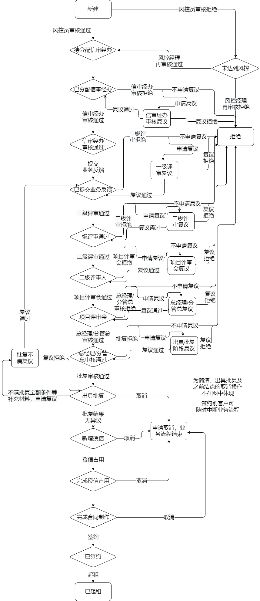
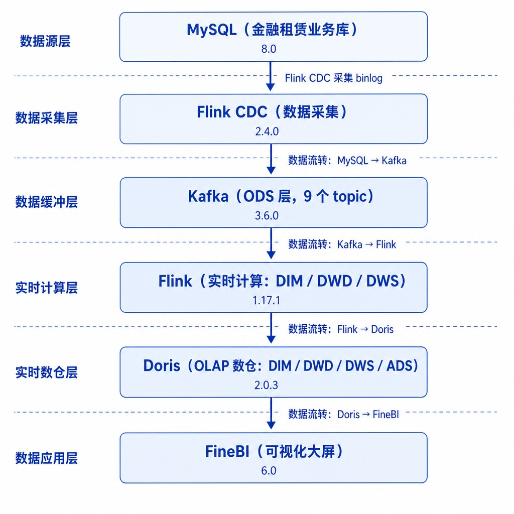
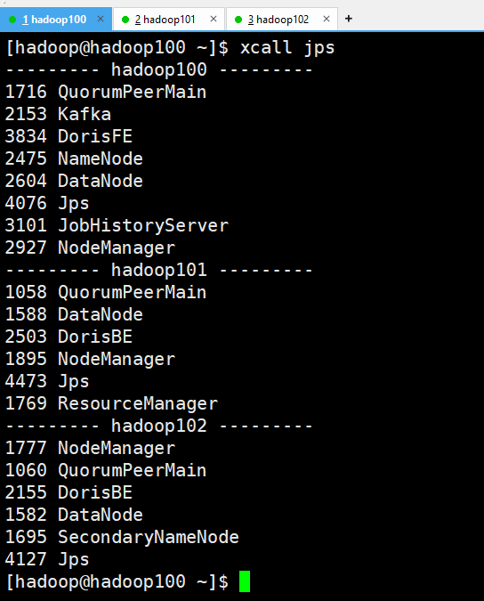
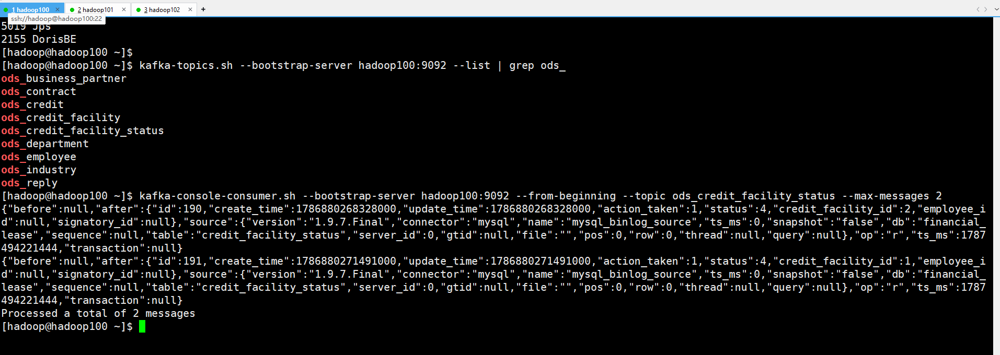
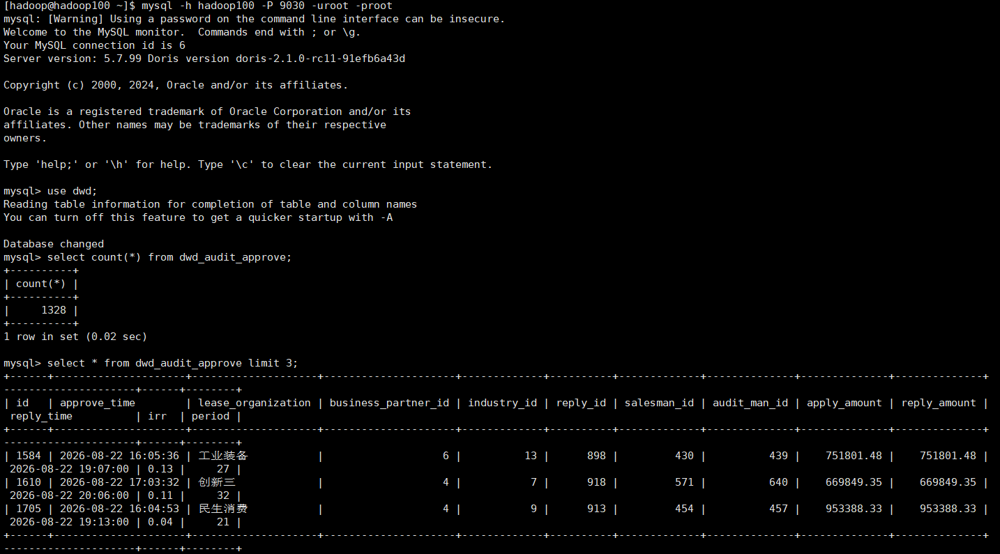
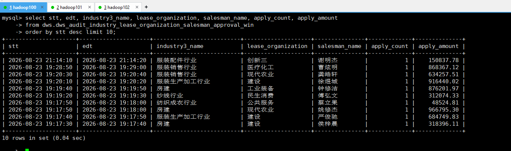
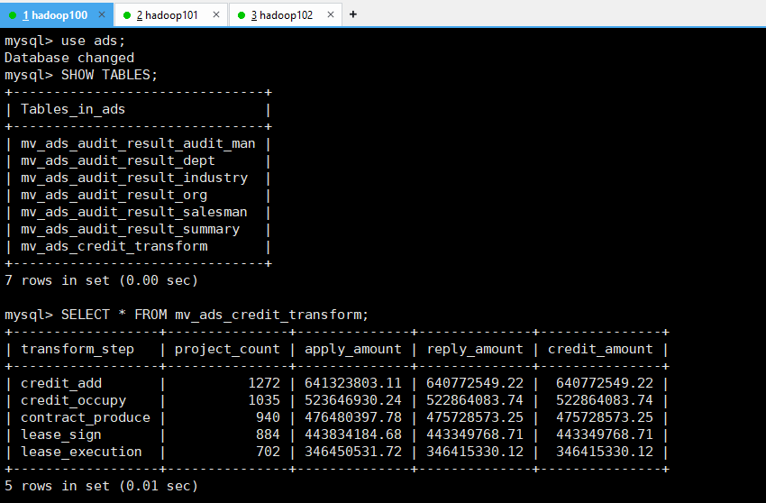
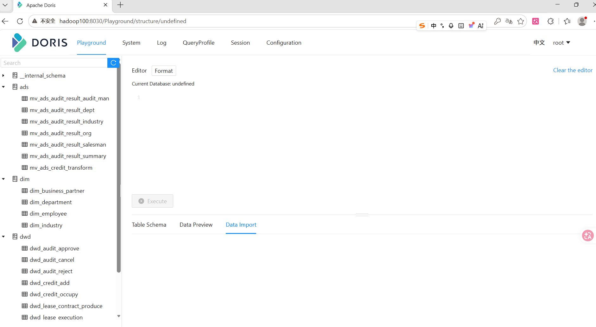
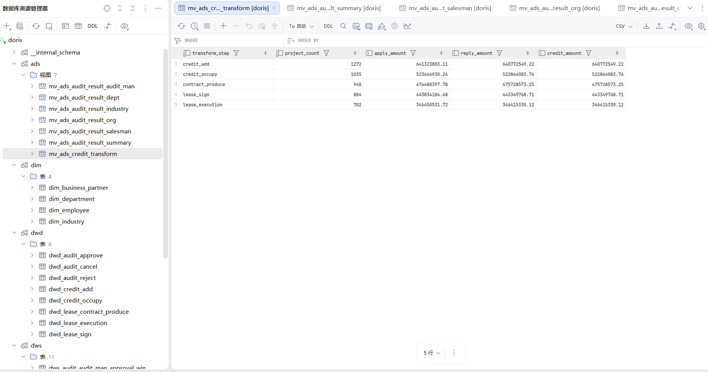
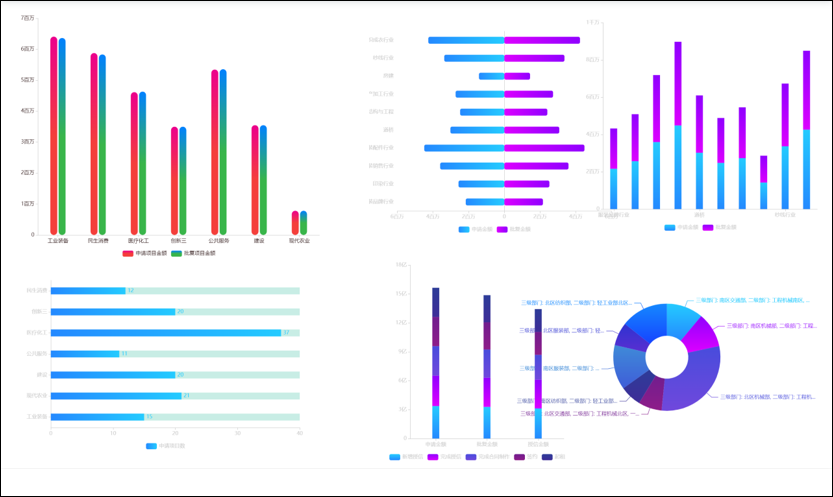

# 金融租赁实时数仓（Financial Lease Realtime Warehouse）

> Flink CDC + Kafka + Doris 构建的金融租赁授信审批实时数仓：实时链路（Flink CDC 采集 → Kafka ODS → Flink → Doris）覆盖 ODS → DIM → DWD → DWS → ADS 五层建模，FineBI 可视化大屏。

[](https://ververica.github.io/flink-cdc-connectors/)
[](https://flink.apache.org/)
[](https://kafka.apache.org/)
[](https://doris.apache.org/)
[](LICENSE)

## 项目概述

基于 3 节点 CentOS 7 虚拟机集群，构建金融租赁授信审批业务的**实时数据仓库**。

- **数据采集**：Flink CDC 单作业整库读取 `financial_lease` 全部 9 张表，debezium-json 格式按 `source.table` 动态路由写入 Kafka（`ods_表名`）。
- **数仓建模**：Flink DataStream API 构建 ODS → DIM → DWD → DWS → ADS 五层，Doris 统一存储。
  - DIM：4 张维度表（部门/员工/行业/商业合伙人，raw mirror）
  - DWD：8 张事务事实表（审批通过/拒绝/取消、新增授信/占用、合同制作/签约/起租）
  - DWS：11 张窗口聚合表（10 秒滚动窗口，AGGREGATE KEY + 维度拍平）
  - ADS：7 张 Doris 物化视图（已审项目 6 粒度 + 转化漏斗，5 分钟自动刷新）
- **可视化**：FineBI 对接 Doris `ads` 库，输出经营分析驾驶舱（KPI 卡片 + 授信漏斗 + 多维报表）。

## 项目背景与价值

### 为什么要做这个项目？

项目模拟的是金融租赁公司的授信审批业务：客户（承租人）向租赁公司申请授信额度，用于购买设备等资产后「以租代购」。这类业务对数据时效的要求很高：

1. **审批链路长**：一笔授信要经过风控初审、信审、一级/二级评审、项目评审会、总经理逐级审批，节点多、流转复杂，管理层需要实时掌握每个项目卡在哪个环节。
2. **资金体量大、周期长**：从申请到起租往往以月计，任何环节的延误都直接意味着资金占用和风险敞口。
3. **监管要求严**：授信全流程要求留痕、可追溯、准实时报送，欺诈识别、额度超限这类风控场景更是要秒级响应。

这些诉求传统 T+1 数仓满足不了：数据要次日才能看到。所以本项目用 Flink + Doris 搭建实时数仓，把授信审批数据从产生到可视化的延迟压到秒级。

### 解决了什么问题

| 业务痛点 | 传统 T+1 数仓 | 本项目实时数仓 |
|---------|--------------|---------------|
| 审批进度不可见，问题环节无法及时干预 | 次日才能看到流转结果 | 秒级掌握每个项目所处审批节点 |
| 授信转化漏斗无法实时跟踪 | 月底才出报表 | 10 秒窗口实时刷新申请→批复→占用→签约→起租漏斗 |
| 经营指标滞后，决策慢 | 日报 / 月报 | DWS 10 秒滚动聚合 + ADS 5 分钟物化视图，大屏秒级刷新 |
| 监管报送不及时 | 手工汇总 | 全链路流水可追溯，准实时输出 |
| 维度变更同步慢 | 维度表每日刷新 | 维度表实时 mirror，DWD/DWS 实时关联 |

## 业务逻辑说明

### 业务场景

项目模拟的业务是金融租赁授信审批：承租人（企业客户）向租赁公司申请授信，经多级审批后拿到额度，随后完成授信占用、签订合同并起租。全流程围绕主表 `credit_facility`（授信申请）展开，配合多张流转表、明细表记录每个环节。

### 授信生命周期（状态机）



```
授信申请 → 多级审批 → 出具批复（status=16） → 新增授信 → 授信占用 → 合同制作 → 签约 → 起租
                       ├── 拒绝（status=20）─┘
                       └── 取消（status=21）─┘
```

| 环节 | 业务含义 | 数据来源（如何识别） |
|------|---------|---------------------|
| 授信申请 | 客户提交授信申请 | `credit_facility` 插入 |
| 多级审批 | 风控 → 信审 → 一级/二级评审 → 项目评审会 → 总经理逐级审核 | `credit_facility_status` 流转记录 |
| 审批通过 | 出具批复 | 流水表 `status = 16` |
| 审批拒绝 | 风控 / 信审直接拒绝 | 流水表 `status = 20` |
| 审批取消 | 客户 / 业务主动取消 | 流水表 `status = 21` |
| 新增授信 | 批复后生成授信额度 | `credit` 插入 |
| 授信占用 | 客户实际支用额度 | `credit.occupy_time` 非空 |
| 合同制作 | 生成租赁合同 | `contract.produce_time` 非空 |
| 签约 | 双方签署合同 | `contract.signed_time` 非空 |
| 起租 | 合同生效、开始计租 | `contract.execution_time` 非空 |

> 口径备注（开发时踩过坑才确定的）：审批是否通过、授信是否占用、合同是否起租，要看流水记录和时间字段，不能看主表 `status` 的当前值。状态是会继续流转的，比如 16（出具批复）会流转到 19（新增授信），只看当前值会漏掉大部分数据。

### 核心业务指标

| 指标 | 口径 | 层级 |
|------|------|------|
| 已审项目数 | 审批通过 / 拒绝 / 取消的授信申请数 | ADS（6 粒度） |
| 审批金额 | 申请金额 / 批复金额（apply_amount / reply_amount） | DWD / ADS |
| 授信转化漏斗 | 新增授信 → 占用 → 制作 → 签约 → 起租 各环节项目数 | ADS 转化主题 |
| 10 秒实时指标 | 窗口内申请 / 批复笔数与金额 | DWS（11 张窗口表） |
| 维度画像 | 行业 / 部门 / 业务经办 / 信审经办 粒度分布 | ADS 多粒度物化视图 |

## 项目技术架构



```
MySQL(金融租赁业务库 financial_lease)
   │  Flink CDC 采集 binlog（单作业整库读，DataStream API）
   ▼
Kafka（ODS 层，debezium-json，按 source.table 动态路由到 ods_表名）
   │  Flink 读取 Kafka（DataStream API）
   ▼
Doris（数仓建模：DIM / DWD / DWS / ADS 四层）
   │  ADS 用异步物化视图，5 分钟自动刷新
   ▼
FineBI（经营分析驾驶舱 / 大屏）
```

## 项目截图

| 集群进程（jps） | Kafka ODS 数据 |
|:---:|:---:|
|  |  |

| Doris DWD 明细 | DWS 窗口聚合 |
|:---:|:---:|
|  |  |

| Doris ADS 物化视图 | Doris FE Web UI |
|:---:|:---:|
|  |  |

| Doris 各层表（DataGrip） | FineBI 大屏 |
|:---:|:---:|
|  |  |

## 技术栈

| 类别 | 组件 | 版本 |
|------|------|------|
| 业务数据库 | MySQL | 8.0.39 |
| 数据采集 | Flink CDC | 2.4.2 |
| 消息队列 | Kafka | 2.12-3.3.1 |
| 流计算引擎 | Flink | 1.17.1 |
| OLAP 引擎 | Apache Doris | 2.1.0 |
| 协调服务 | ZooKeeper | 3.7.1 |
| 数据可视化 | FineBI | - |
| 代码托管 | GitHub | - |

## 集群规划

| 服务 | hadoop100 | hadoop101 | hadoop102 |
|------|:---:|:---:|:---:|
| MySQL | ✓ | | |
| ZooKeeper | ✓ | ✓ | ✓ |
| Kafka | ✓ | ✓ | ✓ |
| Flink | JM + TM | TM | TM |
| Doris FE | ✓ | | |
| Doris BE | | ✓ | ✓ |
| 模拟数据 | ✓ | | |

> IP：hadoop100=192.168.100.130，hadoop101=192.168.100.131，hadoop102=192.168.100.132

## 数仓分层

| 层 | 存储 | 内容 | 说明 |
|----|------|------|------|
| ODS | Kafka | 9 张表 CDC 原始数据 | Flink CDC 单作业整库读，debezium-json，动态路由 |
| DIM | Doris | 4 张维度表 | 部门/员工/行业/商业合伙人，raw mirror |
| DWD | Doris + Kafka | 8 张事务事实表 | 审批/授信/租赁三域，单作业动态分流，双写 |
| DWS | Doris | 11 张窗口聚合表 | 10 秒滚动窗口，AGGREGATE KEY + REPLACE，维度拍平 |
| ADS | Doris | 7 张物化视图 | 已审项目 6 粒度 + 转化漏斗，5 分钟自动刷新 |

### 业务链路（状态机）

授信申请 → 多级审批（风控 → 信审 → 一级/二级评审 → 项目评审会 → 总经理）→ 出具批复（status=16）→ 新增授信 → 授信占用 → 合同制作 → 签约 → 起租。

> 完整业务逻辑、各环节识别口径与核心指标见上文「业务逻辑说明」一节。

## 目录结构

```
金融实时数仓项目/
├── README.md                 # 项目总览（本文件）
├── 项目介绍.md                # 项目背景与价值 + 业务逻辑说明 + 架构/分层设计
├── flink_test/               # Flink 数仓建模代码工程（DataStream API，五层实现）
├── sql/                      # 数仓各层建表语句
│   ├── dim_ddl.sql           # DIM 层（4 张维度表）
│   ├── dwd_ddl.sql           # DWD 层（8 张事实表）
│   ├── dws_ddl.sql           # DWS 层（11 张窗口聚合表）
│   └── ads_mv.sql            # ADS 层（7 张物化视图）
├── scripts/                  # Linux 启停 / 集群分发脚本
│   ├── zk.sh                 # ZooKeeper 启停
│   ├── kf.sh                 # Kafka 启停
│   ├── hdp.sh                # Hadoop 相关
│   ├── xsync / xcall         # 集群文件分发 / 集群命令执行
│   └── doris-cluster.sh      # Doris FE/BE 一键启停
├── doc/                      # 搭建教程 + 数仓设计源文件
│   ├── 00-业务理解与指标处理.md      # 业务理解 / 指标体系 / 设计决策
│   ├── 01-实时环境搭建.md
│   ├── 02-数仓建模开发.md
│   ├── 03-FineBI可视化制作.md
│   ├── 业务总线矩阵.xlsx             # 数仓设计输入：业务总线矩阵
│   ├── 信贷金融实时指标体系.xlsx      # 数仓设计输入：实时指标体系
│   ├── 事实表.txt                   # DWD 事实表清单
│   ├── 信贷金融业务流程.png          # 业务流程图
│   └── 信贷金融业务流程.drawio       # 流程图源文件（drawio）
├── images/                   # 架构图 + 项目截图
└── 模拟数据脚本/              # 模拟数据生成器
    └── mock-finance-1.3.0.jar
```

## 快速开始

### 1. 启动集群

```bash
# 按依赖顺序启动：MySQL → ZooKeeper → Kafka → Doris → Flink
sh zk.sh start          # ZooKeeper（3 节点）
sh kf.sh start          # Kafka（3 节点）
sh doris-cluster.sh start   # Doris FE + BE
bin/start-cluster.sh    # Flink standalone
```

### 2. 建库建表

```bash
mysql -h hadoop100 -P 9030 -uroot -proot < sql/dim_ddl.sql
mysql -h hadoop100 -P 9030 -uroot -proot < sql/dwd_ddl.sql
mysql -h hadoop100 -P 9030 -uroot -proot < sql/dws_ddl.sql
mysql -h hadoop100 -P 9030 -uroot -proot < sql/ads_mv.sql
```

### 3. 生成模拟数据 + 启动 ODS 采集

```bash
java -jar 模拟数据脚本/mock-finance-1.3.0.jar   # 向 MySQL 注入业务数据
# 提交 ODS 作业：Flink CDC 整库同步 → Kafka
bin/flink run -c com.flink.cdc.MysqlCdcToKafka jar/flink_test-1.0-SNAPSHOT.jar
```

### 4. 提交 Flink 数仓作业（按层）

```bash
# DIM 层（4 个作业）
bin/flink run -c com.flink.dim.DimDepartmentJob -d jar/flink_test-1.0-SNAPSHOT.jar
bin/flink run -c com.flink.dim.DimIndustryJob -d jar/flink_test-1.0-SNAPSHOT.jar
bin/flink run -c com.flink.dim.DimEmployeeJob -d jar/flink_test-1.0-SNAPSHOT.jar
bin/flink run -c com.flink.dim.DimBusinessPartnerJob -d jar/flink_test-1.0-SNAPSHOT.jar

# DWD 层（单作业，双写 Doris + Kafka）
bin/flink run -c com.flink.dwd.DwdBaseJob -d jar/flink_test-1.0-SNAPSHOT.jar

# DWS 层（11 个窗口聚合作业）
bin/flink run -c com.flink.dws.DwsCreditCreditAddWin -d jar/flink_test-1.0-SNAPSHOT.jar
# ...（其余 10 个 DWS 作业同理）
```

> 具体命令见 `doc/02-数仓建模开发.md`。

### 5. ADS 物化视图 + FineBI

```bash
mysql -h hadoop100 -P 9030 -uroot -proot < sql/ads_mv.sql   # 建 7 张物化视图，5 分钟自动刷新
```

FineBI 连接 Doris（`jdbc:mysql://hadoop100:9030/ads`），导入 `mv_ads_*` 表制作报表（详见 `doc/03-FineBI可视化制作.md`）。

### Web 控制台

| 组件 | 地址 | 账号/密码 |
|------|------|-----------|
| Flink Web UI | http://hadoop100:8081 | — |
| Doris FE | http://hadoop100:8030 | root / root |
| FineBI | 本地客户端 | 登录 FineBI |

## 数据验证

- **DWD 漏斗自洽**：新增授信 1272 → 授信占用 1035 → 合同制作 940 → 签约 884 → 起租 702（层层递减）
- **ADS 一致性**：6 张粒度表 project_count / 金额 总和 = DWD 行数，完全一致
- **维度一致性**：DWS/ADS 维度名称与 dim 表 join 无差异

## 关键指标

| 指标 | 数值 |
|------|------|
| 数据表总数 | ODS 9 + DIM 4 + DWD 8 + DWS 11 + ADS 7 = 39 |
| DWD 事实表 | 8 张，覆盖审批/授信/租赁三域 |
| DWS 汇总表 | 11 张，10 秒滚动窗口 |
| ADS 物化视图 | 7 张，5 分钟自动刷新 |
| 授信转化漏斗 | 1272 → 1035 → 940 → 884 → 702 |
| 审批终态 | 通过 1328 + 拒绝 1088 + 取消 269 |
| 集群规模 | 3 节点 CentOS 7.9 |

## License

MIT
